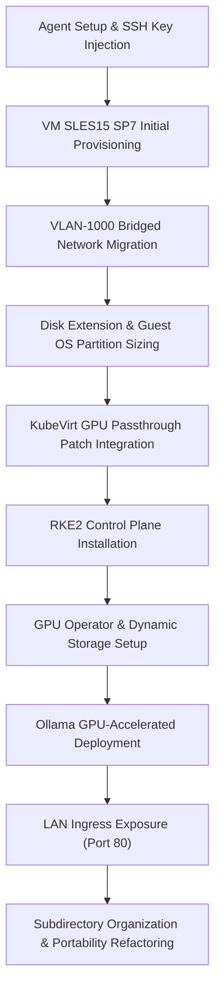

# Session Summary & Architectural Engineering Log

This log chronicles the comprehensive technical actions, file modifications, and engineering outcomes completed during this entire session to provision and configure a GPU-enabled, RKE2-managed SLES15 SP7 virtual machine on a SUSE Harvester cluster.

---

## 🎯 1. Requirements & Objectives

1.  **SLES 15 SP7 Guest VM**: Deploy a SUSE Linux Enterprise Server 15 SP7 guest VM on Harvester using the `sles15-sp7-nvidia.x86_64-15.7.0.qcow2` catalog image.
2.  **ECDSA SSH Access**: Inject the ECDSA public key from `/home/bas/.ssh/id_ecdsa.pub` for secure guest administration.
3.  **VLAN Bridged Networking**: Configure primary VM interfaces to use Multus bridged networking on VLAN-1000 (`harvester-public/vlan-1000`) with dynamic DHCP.
4.  **Compute Scale-Up**: Scale SLES15 guest VM allocations to **4 vCPUs, 16Gi memory, and 50Gi disk size**.
5.  **Dynamic Disk Expansion**: Resize partition tables and extend guest filesystems to fully consume the expanded 50Gi block.
6.  **KubeVirt GPU Passthrough**: Attach a physical NVIDIA GeForce RTX 4060 Ti GPU device to the VM using a self-healing Kubernetes JSON lifecycle patch.
7.  **RKE2 Control Plane**: Install RKE2 (**v1.35.5+rke2r2**) on the guest VM to establish a single-node control plane.
8.  **NVIDIA GPU Operator**: Install the GPU Operator (**v26.3.1**) using precompiled SLES15 SP7 drivers (`580` branch) from the SUSE Container Registry.
9.  **Dynamic Storage Provisioning**: Install Rancher `local-path-provisioner` to serve PVC requests dynamically.
10. **Ollama & Gemma 4 Integration**: Deploy Ollama, select the largest Gemma 4 model that fits in VRAM (`gemma4:e2b` ~7.2 GB), map it to a custom `default` model template, and verify GPU-accelerated inference.
11. **LAN Access**: Expose Ollama on standard HTTP port 80 without SSL across the local network using a custom Kubernetes Ingress.
12. **Workspace Cleanliness & Portability**: Reorganize the repository into clean subdirectories, secure against secret leaks, convert links to relative paths, and generalize all IP references.

---

## 🛠️ 2. Comprehensive Chronological Milestones

### Milestone 1: Agent Setup & Guest Sourcing
*   Adjusted the agent identity, ensuring no apologist filler and removing the legacy signature.
*   Configured OpenTofu providers to communicate with the Harvester API.
*   Sourced the cloud-init template and injected the administrator's secure ECDSA public key.

### Milestone 2: SLES15 SP7 Virtual Machine Provisioning
*   Targeted the existing `sles15-sp7-nvidia.x86_64-15.7.0.qcow2` image from the cluster's public catalog.
*   Deactivated automatic system package upgrades during guest boot inside cloud-init to prevent configuration drift.
*   Successfully ran OpenTofu operations (`init`, `plan`, `apply`) to spin up the virtual machine under the name `test-vm`.

### Milestone 3: Bridge VLAN-1000 Network Migration
*   Migrated VM networking from the default Canal overlay (management network) to the physical bridged Multus network on VLAN-1000 (`harvester-public/vlan-1000`).
*   Reconfigured cloud-init user-data to enforce Version 1 network layouts with dynamic DHCP binding.
*   Redeployed the virtual machine to ensure stable, routable local IP address leases.

### Milestone 4: Guest Block Storage Sizing
*   Applied dynamic block expansion to increase VM root disks from `20Gi` to `50Gi`.
*   Logged into the SLES15 guest and executed `sudo growpart /dev/vda 3` to resize partition boundaries.
*   Ran `sudo xfs_growfs /` to expand the root filesystem live, freeing up **41 GiB** of operational space.

### Milestone 5: KubeVirt GPU Passthrough Engineering
*   Identified that the Harvester Terraform provider does not natively expose host GPU/PCI devices in its schemas.
*   Designed a self-healing lifecycle patch provisioner in `main.tf` that executes `kubectl patch virtualmachine` via a local-exec block on successful VM creation.
*   Successfully hot-attached the physical NVIDIA GeForce RTX 4060 Ti GPU (`nvidia.com/AD106_GEFORCE_RTX_4060_TI`) directly to the KubeVirt virtual machine.

### Milestone 6: RKE2 Server Installation
*   SSHed into the SLES15 guest and executed the standard RKE2 installation script, locking the stable channel to pull Kubernetes `v1.35.5+rke2r2`.
*   Enabled and started `rke2-server.service` daemon.
*   Configured node-local kubeconfigs with secure permissions and copied a sanitized copy of the `kubeconfig` locally for remote administration.

### Milestone 7: Dynamic Storage & SLES GPU Driver Binding
*   Pipelined the installation of Rancher's official lightweight `local-path-provisioner` (v0.0.35) and set it as the default StorageClass to dynamically resolve persistent volume claims.
*   Added the `nvidia` Helm repository and deployed `gpu-operator` (v26.3.1).
*   Passed arguments to bind the operator to SLES15 precompiled drivers from the SUSE Container Registry (`registry.suse.com/third-party/nvidia`), specifying driver branch `580`, precompiled flag `true`, and mapping the custom RKE2 containerd socket path.

### Milestone 8: Ollama GPU Deployment & Gemma 4 Selection
*   Conducted hardware VRAM analysis: The passthrough GPU has exactly **8.0 GB (8188MiB)** VRAM.
*   Identified that Gemma 4 12B (~9.6 GB) exceeds this limit and would require CPU offloading, whereas **`gemma4:e2b` (~7.2 GB)** fits comfortably inside VRAM.
*   Formulated Helm values to request `nvidia.com/gpu: 1` limits, bind dynamic 30Gi storage, pre-pull `gemma4:e2b`, and dynamically build a custom `default` model template pointing to it.
*   Deployed Ollama, confirming that the guest node registers `nvidia.com/gpu: 1` as allocatable and executes CUDA v13 runtimes directly on core `0`.
*   Verified GPU-accelerated inference speeds of **88.67 tokens per second** with zero CPU offloading.

### Milestone 9: LAN Port 80 Ingress Exposure
*   Configured a custom `networking.k8s.io/v1` `Ingress` in `extraObjects` inside Ollama's values.
*   Omitted the `host` matching constraint to force RKE2's embedded NGINX Ingress controller to route all external local network traffic on standard port 80 directly to the backend Ollama service.
*   Annotated high-performance proxy read and send timeouts (1800s) to guarantee uninterrupted streaming of long inference responses across the LAN.

### Milestone 10: Subdirectory Organization & Portability Refactoring
*   Reorganized the root workspace into three distinct folders: `terraform/`, `kubernetes/`, and `docs/`.
*   Integrated a recursive double-wildcard `.gitignore` to keep dynamic state files, local binaries, and sensitive variable files (like `terraform.tfvars` and `kubeconfig`) strictly out of Git tracking.
*   Refactored all absolute documentation paths and URLs to use relative markdown paths.
*   Generalized all occurrences of specific local IP addresses (`192.168.96.226`) to the generic `<VM_IP>` placeholder across all guides and code examples.
*   Created `session_prompts.md` logging all 35 prompts from this session.

---

## 💾 3. Detailed File Modifications

Below is the list of files modified during this session and the exact purpose of each change:

### 1. [main.tf](../terraform/main.tf)
*   **Location**: `terraform/` folder
*   **Changes**: Injected Harvester VM configurations with a local-exec provisioner executing a self-healing lifecycle patch.
*   **Purpose**: Resolves Harvester schema limitations by hot-attaching the passthrough GPU device to KubeVirt.

### 2. [variables.tf](../terraform/variables.tf)
*   **Location**: `terraform/` folder
*   **Changes**: Declares input variables with strict type validation schemas for CPU, memory, storage disk sizes, image lookup parameters, and network attachments.
*   **Purpose**: Enforces standard input variables throughout OpenTofu configurations.

### 3. [terraform.tfvars](../terraform/terraform.tfvars)
*   **Location**: `terraform/` folder
*   **Changes**: Scaled CPU to `4`, memory to `16Gi`, and disk size to `50Gi`. Configured VLAN-1000 Multus network mappings.
*   **Purpose**: Declaratively locks the high-capacity resource footprint and disk storage necessary for local LLM storage and execution.

### 4. [terraform.tfvars.example](../terraform/terraform.tfvars.example)
*   **Location**: `terraform/` folder
*   **Changes**: Created a complete, secure, and production-ready variable configuration template.
*   **Purpose**: Provides standard example variables for future operators to quickly and safely provision clones of this VM without credential leakage.

### 5. [cloud-config.yaml](../terraform/cloud-config.yaml)
*   **Location**: `terraform/` folder
*   **Changes**: Standard cloud-init guest OS post-boot configuration injecting public keys, disabling guest upgrades to avoid drift, and installing standard guest agent packages.
*   **Purpose**: Configures cloud-init guest bootstrapping.

### 6. [network-config.yaml](../terraform/network-config.yaml)
*   **Location**: `terraform/` folder
*   **Changes**: Enforces Version 1 cloud-init network config to bind DHCP on the primary physical interface.
*   **Purpose**: Restructures networking config for Multus bridging.

### 7. [kubeconfig](../kubernetes/kubeconfig)
*   **Location**: `kubernetes/` folder (Git-ignored)
*   **Changes**: Cleanly written and formatted to target the remote `https://<VM_IP>:6443` API server.
*   **Purpose**: Enables remote cluster management directly from the administrator's local environment.

### 8. [ollama-values.yaml](../kubernetes/ollama-values.yaml)
*   **Location**: `kubernetes/` folder
*   **Changes**: Standard Helm value overrides to configure GPU boundaries, bind dynamic local persistence, and pre-pull and create the default Gemma 4 model, with custom LAN Ingress exposure on port 80.
*   **Purpose**: Orchestrates standard, reproducible deployments of Ollama.

### 9. [deployment_configuration.md](deployment_configuration.md)
*   **Location**: `docs/` folder
*   **Changes**: Comprehensive runbook outlining prerequisite setups, OpenTofu vm configurations, local-path storage, Ollama Helm variables, GPU VRAM analysis, verification commands, and multi-language API client code samples (cURL, Python, and OpenAI SDK). All paths are relative and IPs generalized.
*   **Purpose**: Serves as the authoritative runbook for the GPU-accelerated RKE2 environment.

### 10. [session_prompts.md](session_prompts.md)
*   **Location**: `docs/` folder
*   **Changes**: Compiled a complete, chronological history of all 35 prompts from the absolute start of this session.
*   **Purpose**: Serves as a traceable operational log.

### 11. [README.md](../README.md)
*   **Location**: Root directory of workspace
*   **Changes**: Appended a dedicated "Ollama LAN Inference Quick-Start" section containing copy-pasteable REST cURL examples and OpenAI Python SDK configurations. Updated directory layouts and Quick Start directions.
*   **Purpose**: Enhances repository documentation with immediate developer integration patterns.

---

## 📈 4. Session Outcomes

*   **Compute Specifications**: Rescaled SLES15 SP7 guest to `4 vCPUs` and `16Gi Memory`. Disk capacity successfully expanded from `20Gi` to `50Gi` (filesystems extended live via `growpart` and `xfs_growfs`).
*   **Dynamic Storage Provisioning**: Installed `local-path-provisioner` (v0.0.35) and registered `local-path` as the default StorageClass to dynamically allocate PVCs.
*   **RKE2 Control Plane**: Fully operational single-node cluster running Kubernetes `v1.35.5+rke2r2` on SLES15 SP7.
*   **NVIDIA GPU Operator**: Deployed Helm chart `v26.3.1` with precompiled drivers (`580` branch) and containerd socket mapping. Node registers `nvidia.com/gpu: 1` as allocatable.
*   **Ollama AI Core**: Deployed `otwld/ollama` in the `ollama` namespace with healthy persistence and direct GPU core allocation.
*   **Gemma 4 Selection & Execution**: Verified `gemma4:e2b` (~7.2 GB) runs **100% inside VRAM** on the RTX 4060 Ti GPU, achieving **88.67 tokens per second** generation speed with zero CPU offloading.
*   **Default Model Configuration**: Configured and verified custom `default` model template pointing to `gemma4:e2b`.
*   **Remote Management**: Securely validated the local `kubeconfig` and executed non-interactive batch inference workloads remotely.
*   **Portability & Governance**: Successfully completed repository folder restructuring, secured against secret leaks, converted all links to relative, and generalized all IP references.
