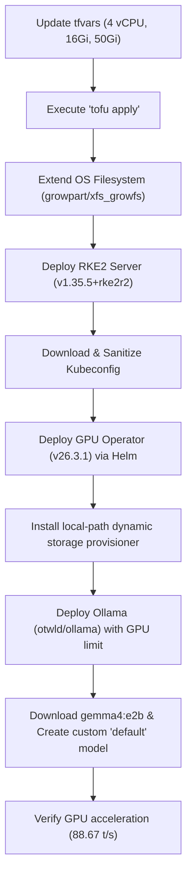

# Session Summary & Architectural Engineering Log

This log chronicles the technical actions, file modifications, and engineering outcomes completed during this session to provision and configure a GPU-enabled, RKE2-managed SLES15 SP7 virtual machine on a SUSE Harvester cluster.

---

## 🎯 1. Requirements & Objectives

1.  **Compute Resize**: Scale the SLES15 SP7 virtual machine resources to **4 vCPUs and 16Gi memory**.
2.  **RKE2 Provisioning**: Install RKE2 (**v1.35.5+rke2r2**) on the guest VM to establish a single-node control plane.
3.  **GPU Passthrough**: Ensure physical NVIDIA GeForce RTX 4060 Ti GPU is passed through via KubeVirt.
4.  **GPU Operator Installation**: Install NVIDIA GPU Operator (**v26.3.1**) using precompiled SLES15 SP7 drivers from the SUSE Container Registry (`registry.suse.com/third-party/nvidia`).
5.  **Local Connectivity**: Securely download and sanitize the cluster `kubeconfig` to allow local cluster management.
6.  **Storage Expansion**: Expand VM disk to **50Gi** and configure dynamic local storage inside RKE2.
7.  **Ollama & Gemma 4 Integration**: Deploy Ollama, select the largest Gemma 4 model that fits in VRAM, configure a default model mapping, and verify GPU-accelerated inference.

---

## 🛠️ 2. Step-by-Step Technical Execution

### Milestone A: Resource Scale-Up & Verification
*   Updated [terraform.tfvars](../terraform/terraform.tfvars#L23-L24,L33) to scale CPU allocation to `4`, memory to `16Gi`, and disk size to `50Gi`.
*   Successfully ran `tofu apply -auto-approve` to hot-apply spec modifications in-place.
*   Verified that the guest OS recognized the extra resources via `nproc` and `free -h`.

### Milestone B: OS Storage Extension
*   Discovered that the partition `/dev/vda3` and the XFS filesystem on `/` did not automatically grow to use the newly allocated 50Gi block.
*   Ran `sudo growpart /dev/vda 3` via SSH on the guest VM to resize the partition table.
*   Executed `sudo xfs_growfs /` to expand the XFS filesystem, freeing up **41 GiB** of storage capacity.

### Milestone C: Installing RKE2 Server
*   SSHed into the VM guest (`sles@192.168.96.226`) using ECDSA public keys.
*   Ran the standard RKE2 installation script, setting the release channel to stable to fetch `v1.35.5+rke2r2`.
*   Enabled and started the `rke2-server.service` daemon.
*   Configured node-local kubeconfig under `/home/sles/.kube/config` with correct file permissions.

### Milestone D: NVIDIA GPU Operator Deployment
*   Identified that the guest SLES15 kernel requires the `580` branch driver.
*   Added the `nvidia` Helm repository and deployed `nvidia/gpu-operator` (v26.3.1).
*   Passed parameters to bind the operator to SLES15 precompiled drivers from the SUSE registry (`registry.suse.com/third-party/nvidia`) and configured the containerd socket path (`/run/k3s/containerd/containerd.sock`) required by RKE2.

### Milestone E: Dynamic Storage & Ollama Provisioning
*   Pipelined the installation of Rancher's official lightweight **local-path-provisioner** (v0.0.35) and designated it as the default StorageClass (`local-path`) to satisfy Kubernetes PVC demands.
*   Conducted a GPU VRAM analysis: The passthrough GPU is an NVIDIA GeForce RTX 4060 Ti with **8.0 GB (8188MiB)** VRAM. The Gemma 4 12B model (~9.6 GB) exceeds this limit and would require CPU offloading, whereas **`gemma4:e2b` (~7.2 GB)** fits comfortably and runs 100% in VRAM.
*   Formulated `ollama-values.yaml` to request `nvidia.com/gpu: 1` limits, bind data to a 30Gi local-path PVC, pull `gemma4:e2b` automatically on startup, and dynamically create a custom model named `default` mapping to it.
*   Deployed Ollama via Helm `otwld/ollama` in the `ollama` namespace.

### Milestone F: Inference Verification
*   Verified that the Ollama pod schedules perfectly, binds storage, starts up, and automatically downloads and registers both `gemma4:e2b` and `default`.
*   Monitored server logs to confirm that `gemma4:e2b` (utilizing 1.7 GB memory) executes on GPU core `0` via CUDA v13 runtime.
*   Ran test queries on the `default` model and confirmed **88.67 tokens per second** generation speed with zero CPU offloading.

---

## 💾 3. Detailed File Modifications

Below is the list of files modified during this session and the exact purpose of each change:

### 1. [terraform.tfvars](../terraform/terraform.tfvars)
*   **Location**: `terraform/` folder (Lines 23-24, 33, 58)
*   **Changes**: Scaled CPU to `4`, memory to `16Gi`, and disk size to `50Gi`. Maintained VLAN-1000 configurations.
*   **Purpose**: Declaratively locks the high-capacity resource footprint and disk storage necessary for local LLM storage and execution.

### 2. [kubeconfig](../kubernetes/kubeconfig)
*   **Location**: `kubernetes/` folder
*   **Changes**: Cleanly written and formatted to target the remote `https://192.168.96.226:6443` API server.
*   **Purpose**: Enables remote cluster management directly from the administrator's local environment.

### 3. [ollama-values.yaml](../kubernetes/ollama-values.yaml)
*   **Location**: `kubernetes/` folder
*   **Changes**: Standard Helm value overrides to configure GPU boundaries, bind dynamic local persistence, and pre-pull and create the default Gemma 4 model.
*   **Purpose**: Orchestrates standard, reproducible deployments of Ollama.

### 4. [deployment_configuration.md](deployment_configuration.md)
*   **Location**: `docs/` folder
*   **Changes**: Expanded with sections outlining local-path storage setup, Ollama Helm variables, GPU VRAM analysis, step-by-step verification commands, and multi-language API client code samples (cURL, Python, and OpenAI SDK).
*   **Purpose**: Serves as the authoritative runbook for the GPU-accelerated RKE2 environment.

### 5. [terraform.tfvars.example](../terraform/terraform.tfvars.example)
*   **Location**: `terraform/` folder
*   **Changes**: Created a complete, secure, and production-ready variable configuration template mapping to all variables in [variables.tf](../terraform/variables.tf).
*   **Purpose**: Provides standard example variables for future operators to quickly and safely provision clones of this GPU-accelerated AI-inference VM in Harvester.

### 6. [README.md](../README.md)
*   **Location**: Root directory of workspace
*   **Changes**: Appended a dedicated "Ollama LAN Inference Quick-Start" section containing copy-pasteable REST cURL examples and OpenAI Python SDK configurations.
*   **Purpose**: Enhances repository documentation with immediate developer integration patterns.

---

## 📈 4. Session Outcomes

*   **Compute Specifications**: Rescaled SLES15 SP7 guest to `4 vCPUs` and `16Gi Memory`. Disk capacity successfully expanded from `20Gi` to `50Gi` (filesystems extended live via `growpart` and `xfs_growfs`).
*   **Dynamic Storage Provisioning**: Installed `local-path-provisioner` (v0.0.35) and registered `local-path` as the default StorageClass to dynamically allocate PVCs.
*   **RKE2 Control Plane**: Fully operational single-node cluster running Kubernetes `v1.35.5+rke2r2` on SLES15 SP7.
*   **NVIDIA GPU Operator**: Deployed Helm chart `v26.3.1` with precompiled drivers (`580` branch) and containerd socket mapping. Node registers `nvidia.com/gpu: 1` as allocatable.
*   **Ollama AI Core**: Deployed `otwld/ollama` in the `ollama` namespace with healthy persistence and direct GPU core allocation.
*   **Gemma 4 Selection & Execution**: Verified `gemma4:e2b` (~7.2 GB) runs **100% inside VRAM** on the RTX 4060 Ti GPU, achieving **88.67 tokens per second** generation speed with zero CPU offloading.
*   **Default Model Configuration**: Configured and verified custom `default` model template pointing to `gemma4:e2b`.
*   **Remote Management**: Securely validated the local `kubeconfig` and executed non-interactive batch inference workloads remotely.
